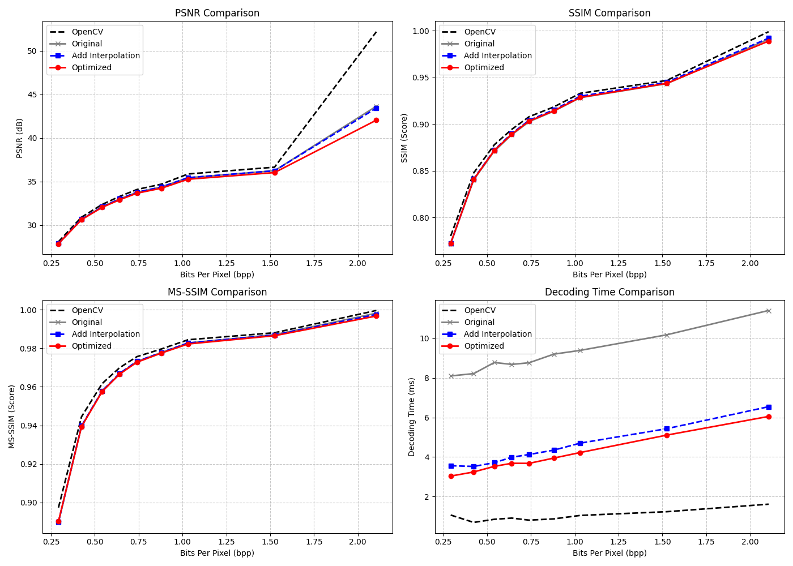
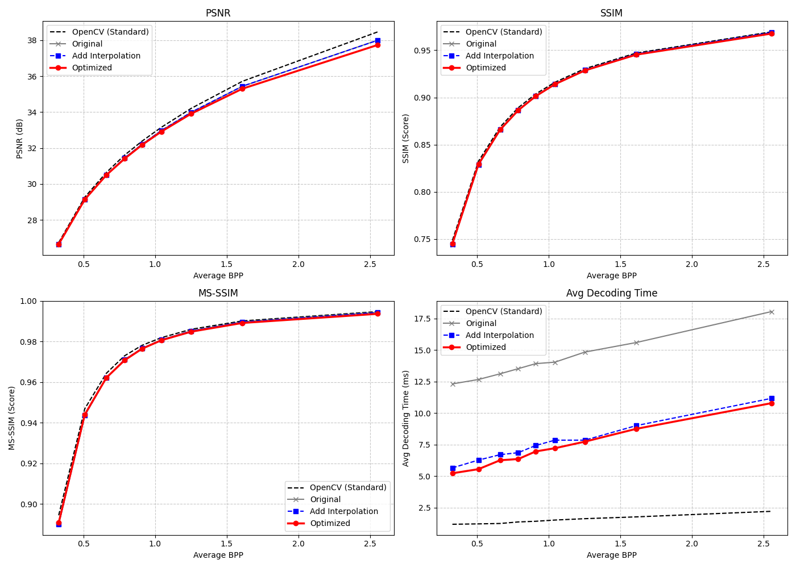
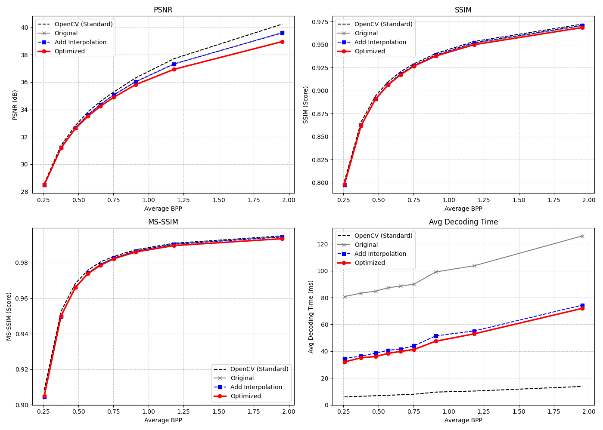

# JPEG_Decoder

## Requirements
```bash
python==3.13.5
```
```bash
opencv-python
numpy
scikit-image
matplotlib
torch
torchmetrics
```

## Installation
1. Install conda environment
```bash
conda craete -n jpeg python=3.13.5 -y
```
```bash
conda activate jpeg
```
2. Install the required toolkit.
```bash
pip install -r requirements.txt
```
3. If you are using VSCode, compile the three c++ code.
```bash
g++ -O3 ./jpeg_decoder.cpp -o ./jpeg_decoder
```
```bash
g++ -O3 ./jpeg_decoder_bilinear.cpp -o ./jpeg_decoder_bilinear
```
```bash
g++ -O3 ./jpeg_decoder_optimized.cpp -o ./jpeg_decoder_optimized
```

## Execution
1. JPEG Decoder Original Version
```bash
./jpeg_decoder lena.jpg
```
2. JPEG Decoder Bilinear Interpolation Version
```bash
./jpeg_decoder_bilinear lena.jpg
```
3. JPEG Decoder Optimized Version
```bash
./jpeg_decoder_optimized lena.jpg
```

## Evaluation
1. Image
```bash
python evaluation_image.py
```
2. Dataset: Kodak
```bash
python evaluation_dataset.py kodak_jpg
```
3. Dataset: CLIC
```bash
python evaluation_dataset.py CLIC_jpg
``` 

## Evaluation Result of Image
1. Lena


2. Result



## Evaluation Result of Dataset
1. [Kodak](https://www.kaggle.com/datasets/sherylmehta/kodak-dataset)
   

   
2. [CLIC](https://www.kaggle.com/datasets/mustafaalkhafaji95/clic-dataset) High Resolution Dataset
   

